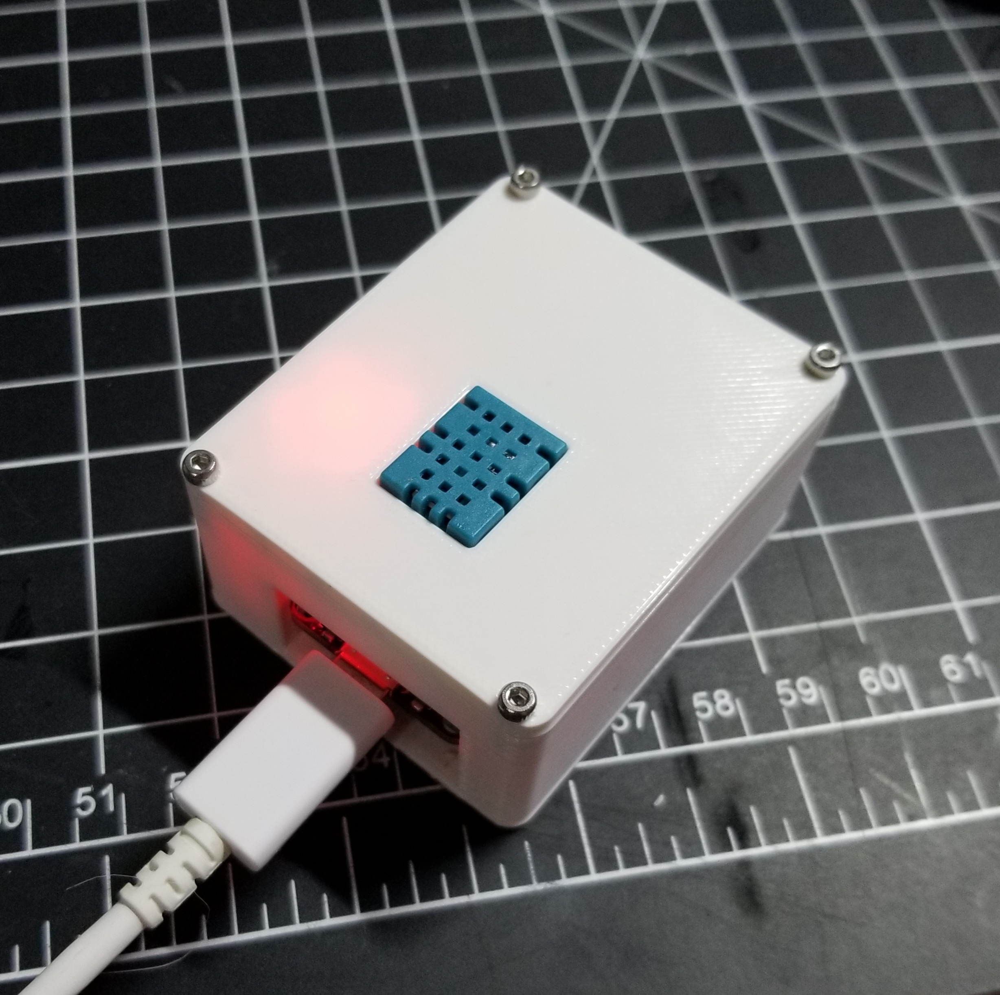
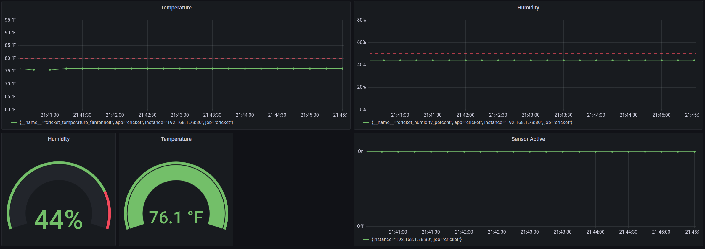
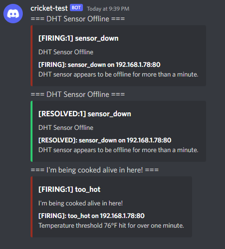
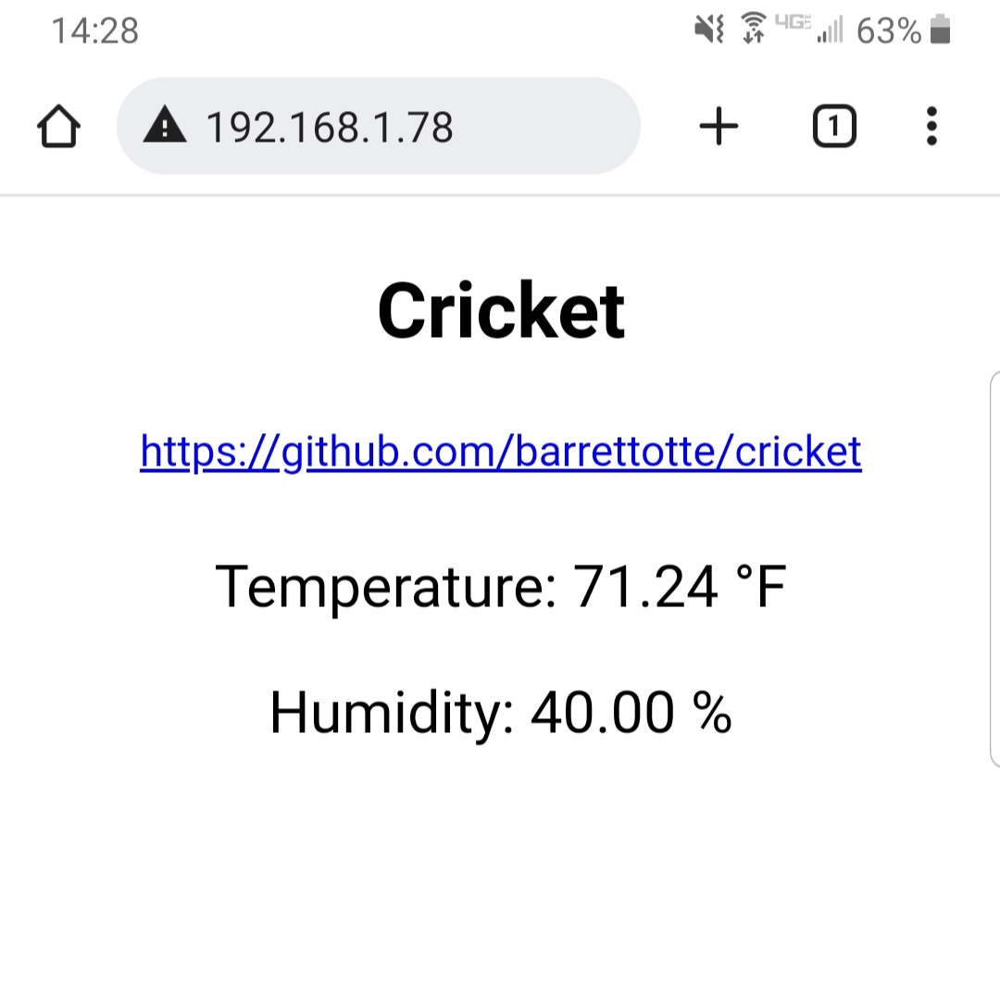
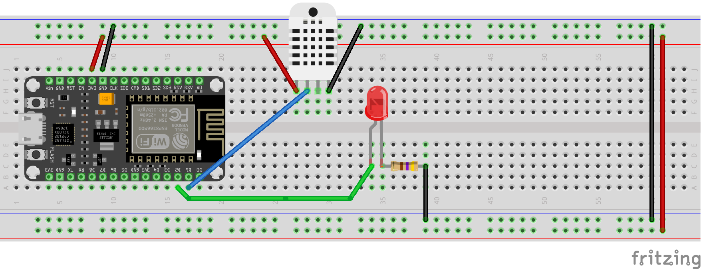
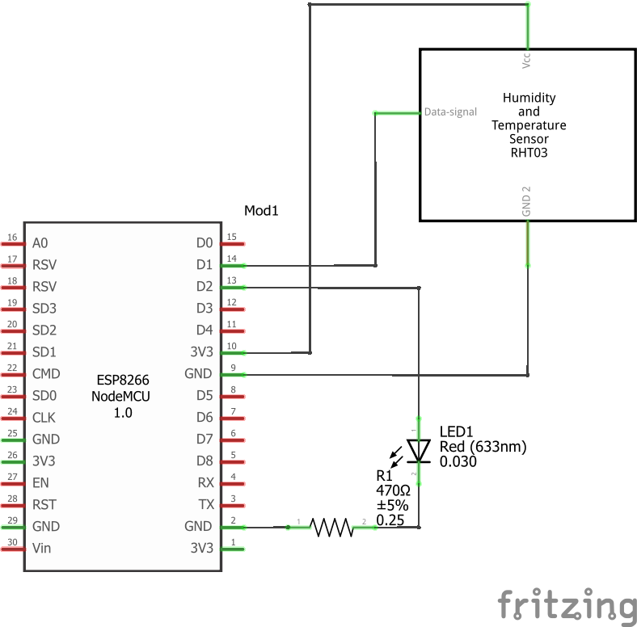
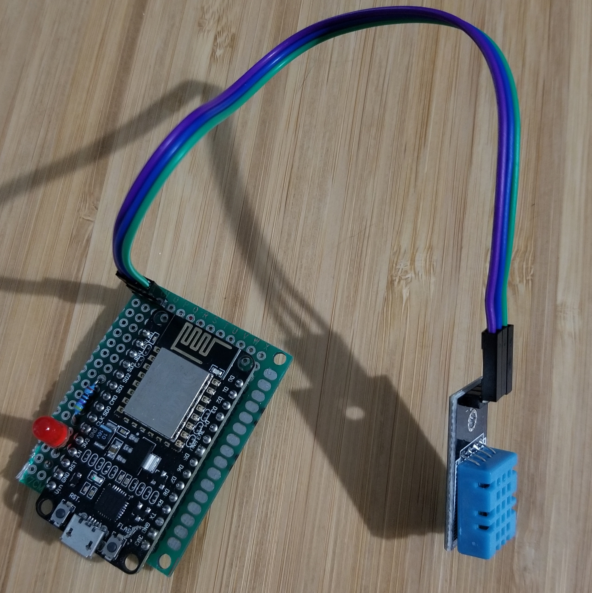

# cricket

Temperature/Humidity sensor metrics in Prometheus with Discord alerting and Grafana.

## Summary

Prometheus pulls metric data from an ESP8266 with a temperature/humidity sensor.

After loading metrics into Prometheus, Grafana is used to build dashboards.

Alerts are triggered based on configured rules in Prometheus. AlertManager sends alerts to Discord via web hooks.

The ESP8266 also hosts a small web server with a homepage to display the current sensor data.
See all endpoints in [test.http](test.http).

## Containers

- `nginx` - Reverse proxy to local IP of ESP8266
- `prometheus` - Metric store for temperature/humidity data 
- `grafana` - Humidity/temperature dashboards over Prometheus
- `alertmanager` - Manages alert notification for alerts firing in Prometheus
- `discord-alerts` - Send alerts to Discord Web Hook
- `cadvisor` - Provide metrics about cgroups

## Hardware

- 1x ESP8266
- 1x DHT11 Temperature Humidity Sensor Module
- 1x Red LED
- 1x 470Ω resistor
- 1x Protoboard
- 4x M2x8mm hex socket screws

I also threw together a basic enclosure in [cad/](cad/). 
It sucks, but its good enough for now.

## Circuit

I decided to learn a little [Fritzing](https://fritzing.org/) for this project, seems pretty cool.
Note that the temperature/humidity sensor below isn't correct, but the DHT11 has the same pinout.

## Build/Run

- Upload firmware to ESP8266 - `make upload`
- Spin up infrastructure - `infra/start.sh`

## References

- ESP8266
  - https://randomnerdtutorials.com/esp8266-web-server-spiffs-nodemcu/
  - https://randomnerdtutorials.com/esp8266-nodemcu-vs-code-platformio-littlefs/
- Prometheus/Grafana
  - https://dzlab.github.io/monitoring/2021/12/30/monitoring-stack-docker/
  - https://github.com/grafana/prometheus-arduino ... note: does not support ESP8266
  - https://github.com/prometheus/docs/blob/main/content/docs/instrumenting/exposition_formats.md
  - https://www.amazon.com/Prometheus-Infrastructure-Application-Performance-Monitoring
- https://github.com/benjojo/alertmanager-discord
- https://docs.platformio.org/en/latest/core/installation/
- https://diarmuid.ie/blog/using-nginx-as-a-reverse-proxy-for-developing-microservice-with-docker-compose
